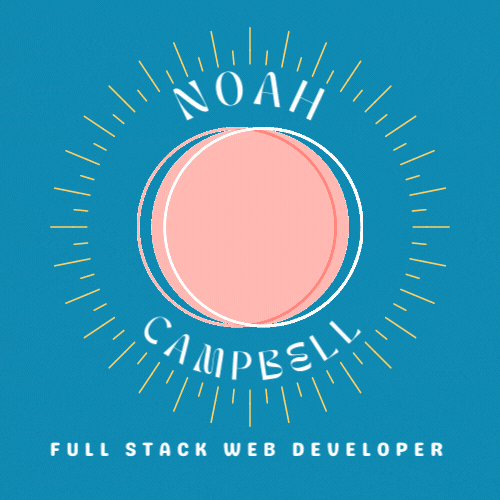

<p align="center">
  
</p>


```javascript
const noah = {
  pronouns: "he" | "him",
  code: [Javascript, Typescript, HTML, CSS, Ruby, Python, Java],
  tools: [React, Redux, Node, Storybook, Styled-Components, Jest, Docker],
  architecture: ["atom design", "event-driven", "design system pattern"],
  challenge: ""
}
```
